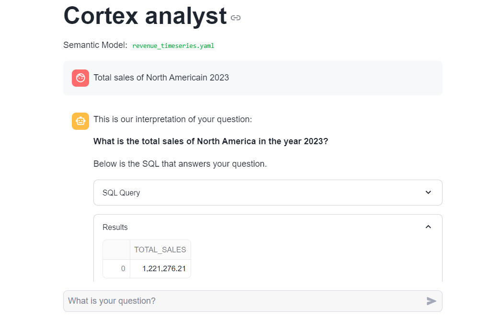

# 🚀 Quickstart with Cortex Analyst
## 📚 Overview
This quickstart guide will help you get started with Cortex Analyst, focusing on how to interact with its service and define Semantic Model definitions that enhance the precision of results from its conversational interface over your Snowflake data.



## 🔍 What You Will Learn
- How to construct and configure a Semantic Model for your data.
- How to call the Cortex Analyst REST API for natural-language question-asking on your structured data in Snowflake.
## 📋 Prerequisites
- **Git**: Ensure you have Git installed. Clone this repository using:
  ```bash
  git clone <repository-url>

Python: Version 3.9 or higher must be installed.

Snowflake Account: A login with a role that can create databases, schemas, tables, stages, user-defined functions, and stored procedures. If needed, register for a free trial account in one of the supported cloud regions.
🛠️ What You'll Build
- A Semantic Model over sample financial data.
- A Streamlit app featuring a conversational interface to Cortex Analyst.

## 🌐 About the Semantic Model
The Semantic Model is defined in the revenue_timeseries.yaml file and includes:

- Logical Tables: Correspond to tables or views in your database.
- Logical Columns: Classified as dimensions, time_dimensions, or measures:
- Measures: Quantitative fields (e.g., total revenue).
- Dimensions: Categorical fields (e.g., product line).
- Time Dimensions: Capture temporal features (e.g., date).
🗒️ Example Definitions
- Measure: Daily revenue

measures:
  - name: daily_revenue
    expr: revenue
    description: total revenue for the given day
    synonyms: ["sales", "income"]
    default_aggregation: sum
    data_type: number
Time Dimension: Date
time_dimensions:
  - name: date
    expr: date
    description: date with measures of revenue, COGS, and forecasted revenue
    unique: false
    data_type: date
Dimension: Product line
dimensions:
  - name: product_line
    expr: product_line
    description: product line associated with its own slice of revenue
    unique: false
    data_type: varchar
    sample_values:
      - Electronics
      - Clothing
      - Home Appliances
      - Toys
      - Books
### 📞 Support
For questions or suggestions, please feel free to open an issue in this repository!

#### With Cortex Analyst, transform your Snowflake data interactions into an intuitive conversational experience! 🌟