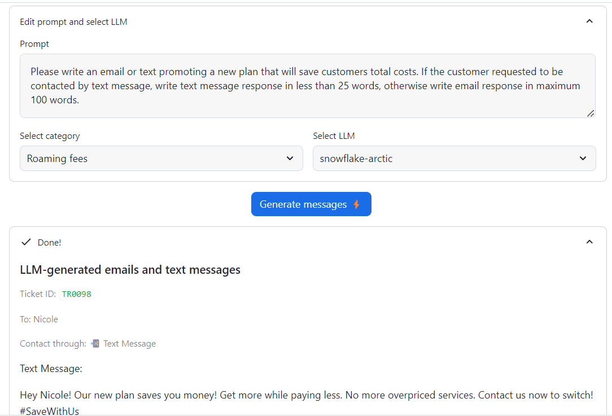

# ⚙️ Fine-tuning for Enterprise Use-Cases with Snowflake Cortex AI

Welcome to the **Fine-tuning for Enterprise Use-Cases** quickstart guide! 
In this guide, we'll explore how organizations can leverage the power of Snowflake Cortex AI to fine-tune large language models, achieving high accuracy in support ticket categorization while significantly reducing inference costs.

## 🌟 Why Fine-tuning?
While larger foundational models like Mistral-Large deliver impressive performance, they come with substantial costs. Fine-tuning allows organizations to make smaller models exceptionally effective at specific tasks—delivering results comparable to those of larger models but at a fraction of the cost.

## 📚 What You Will Learn
By the end of this quickstart guide, you will be able to use **Snowflake Cortex AI** to:
- **Categorize**: Use LLM to effectively categorize support tickets.
- **Generate**: Prepare a training dataset for fine-tuning by leveraging an LLM for annotations.
- **Fine-tune**: Apply a smaller, fine-tuned model to achieve accuracy similar to that of larger models at reduced costs.
- **Generate**: Craft custom email/text communications tailored specifically to each support ticket.


## 🛠️ Prerequisites
Before you begin, ensure that you have:
- A **Snowflake account** in a region where Snowflake Cortex is available. [Check availability here](https://www.snowflake.com/).

- A Snowflake user created with **ACCOUNTADMIN** permissions. This user will be used to get things set up in Snowflake.

- Download the Snowflake Notebook from this Git repository for fine-tuning the model.
 
## 🚀 Getting Started
1. **Clone the Repository**: 
   ```bash
   git clone https://github.com/Tusharr08/Snowflake-Cortex.git
2. Set Up Your Snowflake Environment: Ensure your Snowflake account and user permissions are configured properly. 3. Follow the Notebook Instructions: Open the Snowflake Notebook you downloaded and follow the step-by-step instructions to fine-tune your model.

### 📞 Support & Contributions
We welcome feedback and contributions! If you have any questions or suggestions, please feel free to open an issue in this repository. Your insights are invaluable for enhancing this project.

Fine-tuning models for enterprise applications can dramatically increase efficiency and accuracy. Let's harness the power of Snowflake Cortex AI together! 🚀