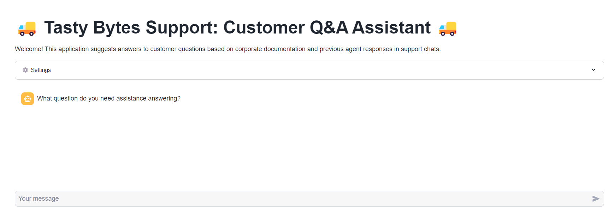

# 🍽️ Powered by Tasty Bytes - RAG Chatbot Using Cortex and Streamlit Quickstart
Welcome to the **Powered by Tasty Bytes** repository, where we will guide you through building a Cortex LLM-powered chatbot designed to help Tasty Bytes agents find answers to customer questions more efficiently. 
This chatbot leverages **Retrieval-Augmented Generation (RAG)** by retrieving previous agent support chat logs and relevant public-facing documents (such as Annual Reports and FAQs).

 <!-- Replace with your chatbot overview image -->
## 📚 What You'll Learn
By following this quickstart guide, you will learn:
- How to build a chatbot using **Cortex LLMs**.
- How to create a **Streamlit** application in Snowflake.
- The fundamentals of **Retrieval-Augmented Generation (RAG)**.
## 🧰 What You'll Need
- A **Snowflake account**: Ensure you have access to a Snowflake account for developing and deploying your chatbot.
## 🚀 What You'll Build
- A fully functional **Cortex LLM chatbot** using Streamlit integrated within Snowflake.
### 🛠️ Getting Started
1. **Clone the Repository**: Begin by cloning this repository to your local machine:
   ```bash
   git clone https://github.com/Tusharr08/Snowflake-Cortex.git

Set Up Your Snowflake Environment: Make sure your Snowflake account is ready for app development.
Follow the Guide: Refer to the instructions in this repository to build and deploy your chatbot.

🤖 Chatbot Features
- Efficient Query Handling: Quickly access historical chat logs and relevant documents to provide accurate answers to customers.
- User-Friendly Interface: A simple and intuitive Streamlit application that enhances user interaction.
- Enhanced Accuracy: RAG capability enriches the response quality by incorporating external knowledge sources.

🗨️ Support & Contributions
We welcome contributions! If you have suggestions or want to report issues, please feel free to open an issue in the repository. Your feedback is crucial for enhancing this project.

With Tasty Bytes and Cortex, empower your agents with cutting-edge technology to streamline customer interactions! Let's get started on building that chatbot! 🚀